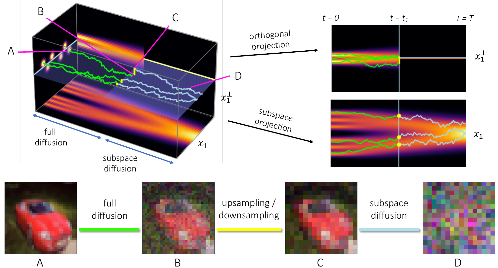

# Subspace Diffusion Generative Models

PyTorch implementation of [Subspace Diffusion Generative Models]() by B Jing, G Corso, R Berlinghieri, T Jaakkola.

We present a method for accelerating and improving score-based generative models. Subspace diffusion restricts (or projects) the diffusion of the data distribution at high noise levels to lower-dimensional subspaces. Due to its reduced dimensionality, the score model for the projected distribution is easier to learn and is faster to evaluate. The original full-dimensional model is used to denoise only at lower noise levels, which reduces the number of effective function evaluations required. On CIFAR-10, our method provides inference speed-ups while preserving the capabilities and improving the performance of state-of-the-art models from [Song, et al., 2021](https://openreview.net/forum?id=PxTIG12RRHS).

**NOTE: This repository is a modification of https://github.com/yang-song/score_sde_pytorch.**



## Dependencies
To install the dependencies, run `pip install -r requirements.txt`. Also run `pip install scipy jax==0.2.8 jaxlib==0.1.60`. We recommend using a Conda environment.

## Training

To train a subspace model, run `main.py` and modify the flag `--config.data.image_size` to the desired subspace dimension. This not only downsamples the image, but also multiples pixel values to make downsampling correspond to a projection onto the orthonormal basis of the subspace.

To train a 16x16 NCSN++ model on CIFAR-10, run
```sh
python main.py --config configs/ve/cifar10_ncsnpp_continuous.py --mode train \
    --config.data.image_size 16 --workdir [WORKDIR]
```

To train a 64x64 NCSN++ model on CelebA-HQ, obtain a tfrecord dataset at `[PATH]` and run
```sh
python main.py --config configs/ve/celebahq_256_ncsnpp_continuous.py --mode train \
    --config.data.image_size 64 --workdir [WORKDIR] --config.data.tfrecords_path [PATH]
```

To train a 64x64 NCSN++ model on LSUN Church, run
```sh
python main.py --config configs/ve/church_ncsnpp_continuous.py --mode train \
    --config.data.image_size 64 --workdir [WORKDIR]
```
Training checkpoints will be saved to `[WORKDIR]`.

## Evaluation

For CIFAR-10, ensure the stats file `cifar10_stats.npz` is available at `assets/stats/`. The Inception score and FID will then be computed and printed automatically by the sampling scripts.

Currently, only the NCSN++ (VE) and DDPM++ (sub-VP) models are supported (shallow or deep). The DDPM++ (sub-VP) models are assumed to have been trained with a data scaler which maps pixel values into `[-1, 1]` and only work for CIFAR-10. Additionally, only CIFAR-10 (`cifar`), CelebA-HQ-256 (`celeba`), and LSUN Church (`church`) are currently supported. To add additional datasets, compute the appropriate statistics (corresponding to the first term in equation 9 in the paper) as described below and add them to `upsampling.py` and `models/subspace_model.py`.

### SDE sampling

To use SDE sampling to generate images, run `subspace_sample.py`. This corresponds to the unconditional upsampling procedure described in the paper.

For example, to sample from a 16x16 NCSN++ subspace diffusion on CIFAR-10 with a cutoff time of `0.5`, run
```sh
python subspace_sample.py --config configs/ve/cifar10_ncsnpp_continuous.py 
    --dataset cifar --time 0.5 --subspace 16 --langevin_snr 0.22 \
    --eval_folder [DIR] --save_name [NAME] --ckpt_subspace [PATH] --ckpt_full [PATH]
```
Samples will be saved to `[DIR]/[NAME].npy`. 

For sampling with the DDPM++ (sub-VP) models on CIFAR-10, ensure that `--langevin_snr 0.01` is used. For CelebA and LSUN, we used `--langevin_snr 0.5`.

### ODE sampling and likelihood

ODE sampling and likelihood evaluation are implemented according to the implicit score representation described in the paper (equation 11). A score model is constructed by "wrapping" a full-mensional model with a subspace model in `models/subspace_model.py`.

To sample from a 16x16 DDPM++ (sub-VP) subspace diffusion on CIFAR-10 with a cutoff time of `0.5`, run
```sh
python main.py --config configs/subvp/cifar10_ddpmpp_continuous.py \
    --dataset cifar  --mode eval_subspace --config.eval.enable_sampling \
    --config.sampling.method ode --subspace 16 --time 0.5 \
    --workdir [DIR] --save_name [NAME] --ckpt_subspace [PATH] --ckpt_full [PATH] 
```
Samples will be saved to `[DIR]/[NAME].npy`. 

To evaluate log-likelihood with the same model, run
```sh
python main.py --config configs/subvp/cifar10_ddpmpp_continuous.py --dataset cifar \
    --mode eval_subspace --config.eval.enable_bpd --subspace 16 --time 0.5 \
    --ckpt_subspace [PATH] --ckpt_full [PATH] 
```

### Inpainting

The inpainting is also implemented using the implicit score representation with `models/subspace_model.py`. To generate a set of inpainting results as shown in the paper, run
```sh
python subspace_inpainting.py --image_path inpainting.png --batch_size 5 \
    --checkpoint_subspace [PATH] --checkpoint_full [PATH] 
```
To only generate inpaintings for a specified subsampling time add `--time 0.5`.

## Analyzing subspaces

We provide notebooks to replicate the subspace and Fisher divergence analyses presented in the paper. 

`analysis/subspace.ipynb` computes the RMSD of the each dataset to the downsampling, PCA, and patch-PCA subspaces of various dimensionalities. These distances correspond to the first term in equation 9, which are required to implement upsampling correctly for additional datasets.

`analysis/divergence.ipynb` computes the orthogonal Fisher divergence for a range of cutoff times for each downsampling subspace of each dataset, with respect to each pretrained model. It also produces the divergence plots and computes the cutoff time for each divergence threshold. These were the cutoff times used in experiments.

## Checkpoints

We provide our trained checkpoints for the subspace models [here](https://drive.google.com/drive/folders/19LTCBtieejCZqIoySsXqkoPVbb9OSCOg). For the DDPM++ models, the last checkpoints are used for ODE sampling and NLL evaluation, while the earlier checkpoints (if any) are used for SDE sampling. To run the subspace diffusion, please also download the corresponding full-dimensional models from https://github.com/yang-song/score_sde_pytorch.